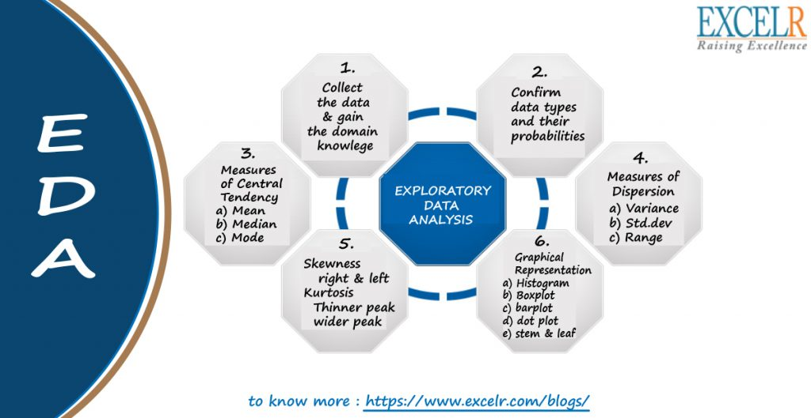

**Note:**

-An R Notebook is an R Markdown document with chunks that can be executed independently and interactively, with output visible immediately beneath the input.

-Notebook output are available as HTML, PDF, Word, or Latex. 

-This Notebook as HTML is preferably open with Google Chrome.

-R-Code can be extracted as Rmd file under the button "Code" in the notebook.

-This Notebook using iterative development. It means the process starts with a simple implementation of a small set of idea requirements and iteratively enhances the evolving versions until the complete version is implemented and perfect.





```{r}

#https://www.excelr.com/exploratory-data-analysis-in-data-science/

```


#General identifying

* View(data)
* glimpse(data) 
* spec(data) for csv file
* attributes(data)
* class(data)


#In depth summarizing

**1-With Summary() from Base:**

```{r}
summary(data)

#Grouping with some of category
#example category: age
by(data,data$age, summary)
```


**2-skim(), from the skimr package:**

```{r}

install.packages("skimr")
library(skimr)
# Descriptive statistics 
skim(data)
skim(data_excel)

#update 
install.packages("dplyr")
library(dplyr)
library(skimr)
group_by(data, category) %>% skim()

```


**3-describe, from the Hmisc package:**

```{r}

install.packages("Hmisc")
library(Hmisc)
Hmisc::describe(data)
describe(data)

```


**4-stat.desc(), from the pastecs package:**

```{r}

install.packages("pastecs")
library(pastecs)
stat.desc(data)

```


**5-describe and describeBy, from the psych package:**

```{r}

install.packages("psych")
library(psych)
psych::describe(data)
describe(data)
psych::describeBy(data, data$type)

#The “mat” parameter does allow you to produce 
#a matrix output of the above.
psych::describeBy(data, data$type, mat = TRUE)

```

**6-descr and dfSummary, from the summarytools package:**

```{r}

install.packages("summarytools")
library(summarytools)
summarytools::descr(data)
#Only works with numerical data. 
descr(data)

#as data.frame
kable(as.data.frame(summarytools::descr(data)))
summarytools::descr(data)

#transpose
summarytools::descr(data, transpose = TRUE)

#Complete menu from summarytools
dfSummary(data)

```


**7-CreateTableOne, from the tableone package:**

```{r}

install.packages("tableone")
library(tableone)

CreateTableOne(data = data)
summary(CreateTableOne(data = data))

CreateTableOne(strata = "category", data = data)

#For example, if we think “score” 
#should not be treated as normal:
print(CreateTableOne(strata = "category", data = data), 
nonnormal = "score")

```


**8-desctable, from the desctable package:**

```{r}

install.packages("desctable")
library(desctable)
desctable(data)

group_by(data, category) %>%
desctable()
 
#This function is super customisable.
desctable(data,stats = list("N" = length, "Mean" = mean, 
"SD" = sd, "Min" = min, "Max" = max))

```


**9-ggpairs, from the GGally package:**

```{r}

install.packages("GGally")
library(GGally)

ggpairs(data)
ggpairs(data, mapping = aes(colour = category))

```

**10-ds_summary_stats from descriptr:**

```{r}

install.packages("descriptr")
library(descriptr)

ds_summary_stats(data$score)
ds_screener(data)
ds_multi_stats(filter(data, !is.na(score)), score, rating)
ds_freq_table(data$category)

```


**11-With dlookr:  An automated report (as pdf or html):**

```{r}

data<-qry_neue_DL
View(diagnose(data))

a<-data %>%
  diagnose() %>%
  select(-unique_count, -unique_rate) %>% 
  filter(missing_count > 0) %>% 
  arrange(desc(missing_count))
View(a)

View(diagnose_numeric(data))
View(diagnose_category(data))

#No 1. Missing values
diagnose_category(data) %>% 
  filter(is.na(levels))

#0.01% list levels
data %>%
  diagnose_category(top = 500)  %>%
  filter(ratio <= 0.01)


#Diagnosing outliers with diagnose_outlier()
diagnose_outlier(data)

#Numeric variables that contain anomalies are easily found 
#with filter().:
diagnose_outlier(data) %>% 
  filter(outliers_cnt > 0) 

#The following is a list of numeric variables with 
#anomalies greater than 5%.:
diagnose_outlier(data) %>% 
  filter(outliers_ratio > 5) %>% 
  mutate(rate = outliers_mean / with_mean) %>% 
  arrange(desc(rate)) %>% 
  select(-outliers_cnt)

#Visualization of outliers using plot_outlier()
data %>%
  plot_outlier(Alter) 

#Use the function of the dplyr package and plot_outlier() 
#and diagnose_outlier() to visualize anomaly values 
#of all numeric variables with an outlier ratio 
#of 0.5% or more.:

data %>%
  plot_outlier(diagnose_outlier(data) %>% 
                 filter(outliers_ratio >= 0.5) %>% 
                 select(variables) %>% 
                 unlist())

data %>%
  plot_outlier(diagnose_outlier(data) %>% 
                 filter(outliers_ratio >= 0.5) %>% 
                 select(variables) %>% 
                 unlist())

data %>%
  diagnose_report(output_format = "html", 
  output_file = "Diagn.html")

```


#Change log update

* 30.09.2018
* 30.01.2019

<Br>

#Preferences

* https://bookdown.org/rdpeng/exdata/exploratory-data-analysis-checklist.html 
* https://www.statistik-nachhilfe.de/
* https://www.crashkurs-statistik.de/
* https://datascienceplus.com/
* https://towardsdatascience.com/

<Br>

#License

[MIT](https://opensource.org/licenses/MIT)